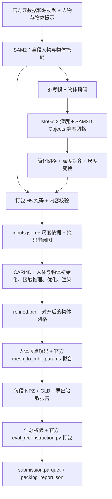

# Track 1 baseline：团队交接与运行指南

更新日期：2026-10-07。业务分支：`ly/track1-baseline-pipeline`，PR 目标：`main`。

**当前适合审阅代码并做单段真实验证，尚未完成新 pipeline 的 GPU 端到端验收。**
功能代码截至 `78ff04630717685125ec16b7f419fb1e77ae125d`；本次交接只补文档。
后续运行应固定实际审阅的 commit，并让程序记录这个 commit。

## 1. 要解决什么问题，目前到哪一步

目标是把 Track 1 视频变成人体运动、物体网格和物体运动，再按官方格式打包。
这次补齐的是输入准备、校验、调度、结果适配和可追溯记录，沿用已有模型与官方转换工具。

| 项目 | 当前证据 | 尚不能据此得出的结论 |
|---|---|---|
| 数据与初始提示 | 30 段、16,563 帧源视频已逐帧解码检查；30 段人/物初始框已看图复核，并绑定源视频和提示哈希 | SAM2 全视频掩码已正确，或静态网格已生成 |
| 工程测试 | 本分支相关 140 项 CPU 测试通过，包含真实视频/H5/网格文件、续跑及进程清理 | 新代码已在 GPU 跑通 |
| 官方打包 | 使用真实官方 30 段、740,780 行名单和**合成重建结果**通过测试 | 全量真实三维重建已完成，或已有 Kaggle 分数 |
| 历史 GPU 结果 | 旧流程跑过 episode 16 的 CARI4D；导出适配曾用其真实结果在 H200 做官方拟合 | 当前 prepare → batch → pack 整体已验收 |
| 当前资源 | 本人的原机房 H200 无库存，创建失败后已核对无运行 Pod，持久盘保留 | 其他队友也没有可用 GPU |

本轮先开 Draft PR，供队友理解与审阅。后续用固定版本跑通一段并检查结果，再决定合入；
合入后统一版本、分配 30 段任务。当前没有启动全量重建、合并 `main` 或提交 Kaggle。

## 2. 完整数据流与代码分工

下图简化了模块内部细节，箭头表示文件流转：



输入准备中的 **SAM3D Objects** 生成静态物体；CARI4D 内的 **SAM 3D Body**
初始化人体，是两个不同组件。MoGe 的尺度估计也不是物体真实尺寸的测量。

| 层 | 入口与职责 | 运行位置 |
|---|---|---|
| 初始输入 | [提示清单](../configs/track1_inputs/README.md)、[preflight](track1_preflight.md)：元数据、视频路径、输入库存 | CPU |
| 输入准备 | [track1_prepare.py](../modules/v2d_pipelines/track1_prepare.py)：调用现有 SAM2、MoGe、SAM3D、网格工具、掩码打包和内容检查 | 已配置的 GPU 容器；SAM2、SAM3D 各用独立 venv |
| 分段调度 | [track1_batch.py](../modules/v2d_pipelines/track1_batch.py)：逐段校验 → CARI4D → 导出；记录失败、有限重试与续跑 | 轻量 Python 调度 GPU 子进程 |
| 重建算法 | [run_inference.py](../modules/v2d_cari4d/lib/run_inference.py)：复用原有八阶段算法，新增缓存身份约束 | 容器基础 Python / GPU |
| 提交适配 | [export_track1.py](../modules/v2d_cari4d/lib/export_track1.py)：调用官方拟合，检查完整帧、数值、单位、物体运动与误差策略 | GPU 解码/拟合 + CPU 校验 |
| 汇总打包 | [track1_pack.py](../modules/v2d_pipelines/track1_pack.py)：校验各段来源、哈希和配置，调用未改动的官方 packer，再检查全部输出行 | CPU |
| 共用机制 | [artifacts.py](../modules/v2d_common/artifacts.py)、[track1_runtime.py](../modules/v2d_pipelines/track1_runtime.py)：文件身份、原子 JSON、锁、包来源检查、超时清理 | CPU |

CARI4D 八阶段依次为：深度估计、组织重建输入、人体初始化、深度对齐、物体姿态、
CoCoNet 推理、联合优化、结果渲染。准备层和调度层通过现有 CLI 连接模型，未重写模型算法。
SAM2 的 H5 输出参数补到了 CLI/Docker wrapper；小网格低于简化面数目标时保留原网格。

## 3. 业务分支、镜像和权重怎么配合

- `main` 承载业务代码；本 PR 从业务分支合入 `main`。镜像维护在 `docker-image`，
  只把 `main` 同步进 `docker-image`，不把镜像分支整体合回业务分支。
- 复用团队的 [RunPod 部署指南](https://github.com/Beardear/video_to_data/blob/docker-image/docs/runpod-session-guide.md)。
  每人使用自己的账号、Pod 和持久盘；共享仓库和镜像。该指南的历史硬件验证以 A100 80GB 为主，
  本轮计划用 H200；新流程的显存峰值和耗时仍待实测。
- 镜像提供 CUDA、模型依赖及 `/workspace/v2d_*` 中的预装代码；权重、数据、业务 checkout
  和输出放 `/vol`。**拉取业务分支不会自动替换镜像内已安装的 Python 包。**
- 一次实验记录业务 commit、镜像构建 commit、不可变 image digest、权重身份和配置。
  只记镜像 tag 或分支名不足以复现。容器内模式根据部署记录登记 digest，无法独立检查宿主镜像库。

“带权重的环境”指已有 GPU 镜像、正确 Python 环境、已下载且布局正确的本地模型权重、
数据和官方 submission kit。代码执行时不自动补齐模型下载，也不会创建 GPU。

## 4. 队友先跑一段：episode 16

以下命令在**已经启动、挂载 `/vol` 并完成初始化的 Pod 中，用同一个 Bash 会话**执行，
从仓库根目录开始。运行前先核对磁盘库存；示例路径需换成自己盘上的真实路径。
这是待 GPU 实测的运行步骤，不是已经验证完成的运行记录。

### 4.1 固定源码、资源和路径

```bash
cd /vol/video_to_data
git fetch origin ly/track1-baseline-pipeline
git switch --detach origin/ly/track1-baseline-pipeline
git status --short
export V2D_BUSINESS_COMMIT="$(git rev-parse HEAD)"
```

开始前工作区应干净；执行期间不继续拉代码或修改提示/配置。之后合入 `main` 时，
改用团队约定的具体提交。不要覆盖已有本地改动。非交互 SSH 会话先加载部署指南中的
`/etc/rp_environment`，保留镜像提供的 FoundationPose / SAM 3D Body 路径。

```bash
export V2D_DATASET=/vol/data/track_1
export V2D_SAM2_WEIGHTS=/vol/weights/sam2
export V2D_SAM3D_WEIGHTS=/vol/weights/sam3d
export V2D_CARI4D_WEIGHTS=/vol/weights/cari4d
export V2D_RUN=/vol/outputs/track1/review-ep16-001
export V2D_KIT=/vol/inputs/track1/kit/v2d_submission_kit

# 由本人填写，不能用占位值执行：MoGe 2 的本地 checkpoint 文件和实际部署身份。
export V2D_MOGE_CHECKPOINT='/实际路径/MoGe2/model.pt'
export V2D_IMAGE_BUILD_COMMIT='实际镜像构建的40位commit'
export V2D_IMAGE_DIGEST='实际镜像仓库@sha256:64位digest'

# 沿用既有单段配置的 CPU 线程限制；渲染使用 EGL。
export OMP_NUM_THREADS=4 MKL_NUM_THREADS=4 OPENBLAS_NUM_THREADS=1
export PYOPENGL_PLATFORM=egl
```

数据根目录应含官方 `meta/` 和视频目录；初始框针对原始 1536×1152 视频。
将数据与 [source_review.json](../configs/track1_inputs/source_review.json) 中的哈希核对，
不要换成裁剪或降采样视频。SAM2 目录需含 `sam2.1_hiera_large.pt`；
SAM3D 需要其 `hf_home` / `torch_home` 缓存，MoGe 参数是 **checkpoint 文件**。
CARI4D 还需要完整的 CoCoNet、FoundationPose、SAM 3D Body / MHR 等权重与资产。
模型命令启用离线模式；缺权重先按部署指南补齐。

官方 kit 使用仓库提供的 ZIP，解压一次；若已有副本，先核对来源再复用：

```bash
python -m zipfile -e docs/v2d_challenge/assets/v2d_submission_kit.zip /vol/inputs/track1/kit
```

必要的重建资产若还是 Git LFS 指针，应先获取对应真实文件。不要修改官方拟合脚本、
packer 或样例名单来绕过检查。

### 4.2 把当前 checkout 安装进三个环境

在镜像已有依赖上替换本地业务包，不重新安装整套 PyTorch/CUDA：

```bash
python -m pip install --no-deps --no-build-isolation \
  -e reconstruction/modules/v2d_common -e reconstruction/modules/v2d_pipelines \
  -e reconstruction/modules/v2d_cari4d/lib -e reconstruction/modules/v2d_moge/lib \
  -e reconstruction/modules/v2d_mesh/lib
/opt/venvs/sam2/bin/python -m pip install --no-deps --no-build-isolation \
  -e reconstruction/modules/v2d_common -e reconstruction/modules/v2d_sam2/lib
/opt/venvs/sam3d/bin/python -m pip install --no-deps --no-build-isolation \
  -e reconstruction/modules/v2d_common -e reconstruction/modules/v2d_sam3d/lib
```

`--no-deps` 不会安装缺失依赖。基础环境还需具备
[`v2d-pipelines[track1]`](../modules/v2d_pipelines/pyproject.toml) 和
[`v2d-common[io]`](../modules/v2d_common/pyproject.toml) 声明的 CPU I/O 依赖。
遇到缺包按声明补齐并记录版本，不盲目升级镜像的模型依赖。
prepare / batch 在执行模型前检查包实际导入路径是否属于当前 checkout；
不要通过删检查来接受旧的 `/workspace` 业务代码。

### 4.3 先计划，再生成输入并看结果

用 Bash 数组保存参数，计划和实际执行使用完全相同的设置：

```bash
V2D_PREPARE=(python -m v2d.pipelines.track1_prepare
  --dataset_root "$V2D_DATASET"
  --preparation_manifest reconstruction/configs/track1_inputs/preparation.json
  --output_dir "$V2D_RUN/prepared"
  --sam2_weights "$V2D_SAM2_WEIGHTS"
  --moge_weights "$V2D_MOGE_CHECKPOINT"
  --sam3d_weights "$V2D_SAM3D_WEIGHTS"
  --image_build_commit "$V2D_IMAGE_BUILD_COMMIT"
  --image_digest "$V2D_IMAGE_DIGEST"
  --episodes 16)
"${V2D_PREPARE[@]}"
```

先检查 `prepared/preparation_plan.json`：只选择 16、`execute=false`、提示 `issue` 为空、
路径正确。计划成功只说明计划可以生成，不验证 GPU 或权重内容。
确认本次资源与范围后，在已有 Pod 执行：

```bash
"${V2D_PREPARE[@]}" --execute
```

成功后检查 `preparation_report.json` 和 `inputs.json`，并人工审阅
`prepared/episode_000016/` 下的 `mask_review.png`、`object_scaled.glb`、
`mesh_scale.json` 与 `validation.json`。看人/物是否分对、遮挡时是否漂移、细柄是否丢失、
网格方向与尺度是否合理；抽样拼图不足以判断时检查完整掩码时间序列。
`semantic_review` 仍是 `required`，程序不会替人完成视觉验收；把结论和截图放进 PR/实验记录。

### 4.4 计划并运行重建与导出

先完成本次分配集合的输入准备，再固定 `inputs.json` 开始 batch。
**不能一边向同一准备目录追加 episode，一边把其可变 `inputs.json` 用于已有 batch。**
batch 身份包含完整清单和登记的输入内容，改清单后必须新建 batch 输出目录。

```bash
V2D_BATCH=(python -m v2d.pipelines.track1_batch
  --dataset_root "$V2D_DATASET"
  --inputs_manifest "$V2D_RUN/prepared/inputs.json"
  --weights_path "$V2D_CARI4D_WEIGHTS"
  --submission_kit "$V2D_KIT"
  --output_dir "$V2D_RUN/batch"
  --config_path reconstruction/modules/v2d_pipelines/track1_baseline.json
  --image_build_commit "$V2D_IMAGE_BUILD_COMMIT"
  --image_digest "$V2D_IMAGE_DIGEST"
  --runtime_mode container
  --episodes 16)
"${V2D_BATCH[@]}"
```

检查 `batch/batch_plan.json` 的选择、输入缺项和实际子命令，再执行：

```bash
"${V2D_BATCH[@]}" --execute
```

Pod 内用 `--runtime_mode container`。宿主 Docker 模式的安装和 digest 校验见
[批量运行说明](track1_batch.md)，不要在 Pod 内照搬宿主 Docker wrapper。
当前 [baseline 配置](../modules/v2d_pipelines/track1_baseline.json) 为 300 步优化、
postopt batch 16、官方 float64 拟合及 `conversion_error_policy=report`。

完成后检查 `batch_report.json`、重建渲染视频、人体/物体时序结果和
`batch/exports/episode_000016/episode_000016_export.json` 的验收与逐帧转换误差。
保留日志、配置、运行环境、各阶段耗时及显存测量，用于估计后续任务成本。

### 4.5 单段官方格式检查

下面命令直接执行 CPU 打包，**没有 `--execute` 开关**，且输出目录必须尚不存在：

```bash
python -m v2d.pipelines.track1_pack \
  --dataset_root "$V2D_DATASET" \
  --export_root "$V2D_RUN/batch/exports" \
  --submission_kit "$V2D_KIT" \
  --output_dir "$V2D_RUN/package-ep16-001" \
  --code_commit_url "https://github.com/Beardear/video_to_data/commit/$V2D_BUSINESS_COMMIT" \
  --episodes 16
```

检查 `packing_report.json` 与 `submission.parquet`。单段产物标记为
`subset_format_check`，不能当作 30 段完整提交；此步骤也不上传 Kaggle 或产生分数。

## 5. 失败、续跑与后续分工

- prepare 失败后检查该段 `logs/`，以相同参数重跑。它没有自动重试循环；只复用身份、
  输入和输出哈希仍一致的成功阶段，半成品不会当成功。
- batch 默认每次调用最多尝试每段两次，内容不合法不重试；推理/导出失败会有限重试，
  失败段不阻断其他段。看 `batch_report.json` 和 `logs/episode_XXXXXX/attempt-*`。
- 同版本、同数据、同配置可重复命令续跑。源码 commit、提示、输入、权重或配置变化，
  使用新的实验目录；旧 episode 16 缓存不能拿来冒充新代码从头运行。
- 默认每次子命令一小时超时，超时或取消会清理对应进程组；**这不是 GPU 费用上限**。
  运行者仍负责资源生命周期，结束后释放自己的 Pod、保留持久盘。
- 调度器在一台机器上逐段运行；团队并行通过各自 Pod 和独立实验目录完成。
  单段通过并合入后，统一业务 commit、镜像、权重、官方 kit、配置，再分配互不重叠的 episode。
  可用 `--episodes 0 1 2` 表示分配子集，按帧数及实测耗时平衡任务，避免只按段数平均分。
- 保留完整官方元数据和源视频。当前身份计算覆盖全名单相关文件；`--episodes` 选择执行范围，
  不代表可以把元数据裁成个人子集。全部 30 段执行另外要求显式 `--all_episodes`。
- 每人交回每段整个 `exports/episode_XXXXXX/`（NPZ、GLB、导出 JSON），以及输入审阅记录、
  batch/preparation 报告和失败日志。集中放入同一个 `export_root`，不要改文件内容或伪造验收。
  收齐 30 段后由一人运行 pack，省略 `--episodes`；collector 会拒绝缺段、混用版本/配置、
  哈希变化和无明确验收的结果。打包成功后，再单独决定 Kaggle 提交。

## 6. 目前的问题与合入前验收

1. **新流程尚缺真实 GPU 闭环。** 当前 H200 容量阻塞，三个 Python 环境的实际联调、权重库存、
   当前源码安装、渲染和官方拟合需在真实 Pod 验证。CPU 模拟无法发现全部 CUDA/依赖/显存问题。
2. **30 段只准备好初始提示。** 还需生成并审阅全段掩码、静态物体网格、尺度记录与输入清单。
   细环、锅柄、滚筒柄、推车遮挡等尤其需要检查；结构通过不等于语义正确。
3. **尺度与重建质量尚未全量评估。** 哈希和尺度依据可追溯不等于真值准确；姿态漂移、
   接触和遮挡错误仍需看重建视频。新流程的全量耗时、峰值显存和磁盘用量尚无实测结论。
4. **官方转换存在拟合误差，目前接受现有方案。** CARI4D 的逐帧人体形状需要拟合为提交格式的
   整段固定体型。episode 16 历史实测：360 帧平均转换误差约 0.407 mm，
   最差帧的平均顶点误差约 2.36 mm；官方样例第 50–289 帧中最差约 0.886 mm。
   这些是转换前后差异，不是相对真值的重建误差，也不能推算 Kaggle 分数损失。
   1 mm 是自定工程门槛。baseline 显式 `report` 只记录超限帧，仍拒绝缺帧、非法结构和非有限数值；
   通用导出 API 默认仍为 `reject`。历史诊断文件不能直接当成本策略下已验收的正式导出。
   转换精度优化保留为后续研究，不是当前 baseline 的前置任务。
5. **还没有全量真实结果或 Kaggle 指标。** `eval_reconstruction.py` 在这条链路中用于官方格式打包；
   本地文件校验不产生排行榜分数，后者需有效提交后由 Kaggle 评测。

建议本 PR 的单段验收记录至少覆盖：

- [ ] 固定版本、真实镜像身份和权重；三个环境实际导入当前业务代码。
- [ ] 在新实验目录从输入准备开始，完成一段真实 prepare → batch → subset pack。
- [ ] 审阅掩码、静态网格/尺度、重建视频和导出误差；保存可供队友看的证据。
- [ ] 同参数再运行确认成功结果可校验续跑；记录耗时、显存和异常。
- [ ] 队友完成代码 review，处理阻断问题，再由负责人确认合入并冻结全量运行版本。

## 7. Review 导航与 CPU 复现

建议按“输入契约 → 准备 → 重建缓存 → 导出 → 调度与汇总”阅读。
细节分别见 [准备](track1_prepare.md)、[预检](track1_preflight.md)、
[导出](track1_export.md)、[批处理](track1_batch.md)、[打包](track1_pack.md)。
重点看阶段失败后是否发布了错误的成功记录、续跑是否绑定源码/输入、
物体是否使用重建中对齐的网格，以及 `report` 是否仅改变验收策略而未改拟合数值。

以下为已通过的 140 项相关 CPU 测试集合，从仓库根目录、已配置的测试环境运行：

```bash
PYTHONDONTWRITEBYTECODE=1 python -m pytest \
  reconstruction/modules/v2d_cari4d/tests/test_run_cache.py \
  reconstruction/modules/v2d_cari4d/tests/test_validate_inputs.py \
  reconstruction/modules/v2d_cari4d/tests/test_track1_export.py \
  reconstruction/modules/v2d_cari4d/tests/test_contract.py \
  reconstruction/modules/v2d_pipelines/tests/test_track1_preflight.py \
  reconstruction/modules/v2d_mesh/lib/tests/test_mesh_simplify.py \
  tests/test_track1_kit_integration.py tests/test_track1_pack.py \
  tests/test_track1_batch.py tests/test_track1_runtime.py tests/test_track1_prepare.py -q
```

测试环境需当前 `v2d-common`、`v2d-pipelines[track1]`、`pytest`，以及仅用于 CPU 函数测试的
`v2d-mesh-lib`（以 `--no-deps` 安装并补齐其轻量导入依赖 `pyglet`）；不要为此在宿主安装整套 ML 环境。
测试实际执行视频/H5 读写、网格简化/缩放、掩码打包、输入校验、官方打包和进程清理；
SAM2、MoGe、SAM3D、渲染深度对齐及 GPU 重建阶段使用显式替身。
这不是整个仓库的完整测试或 GPU CI 通过记录。
